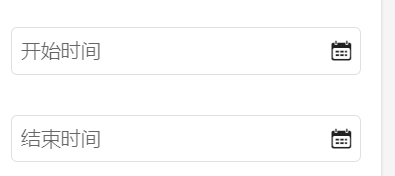
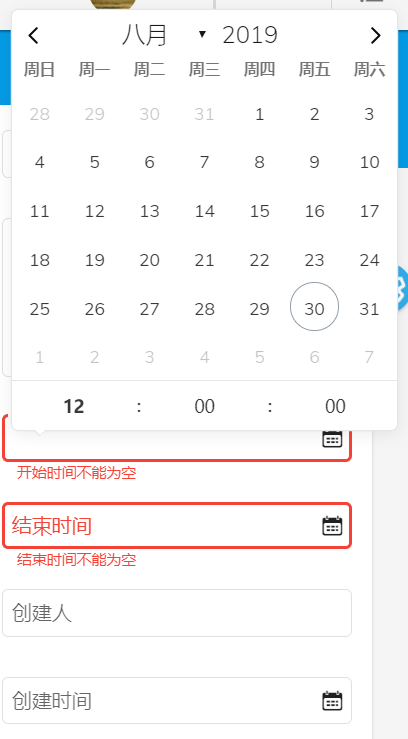
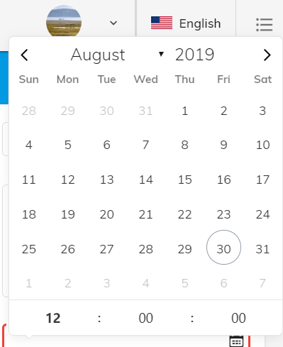
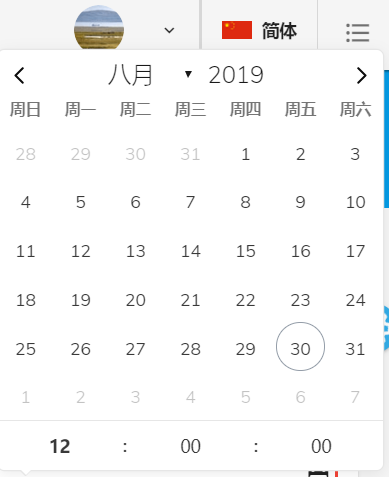
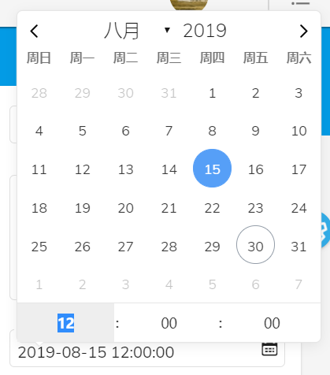

# ng-material-flatpickr

This is a date component that combines [Angular Material component library Input](https://material.angular.io/components/input/overview), date component [flatpickr.js](https://github.com/flatpickr/flatpickr), ReactiveForm formControl, and internationalization (i18n) library [ngx-translate](https://www.npmjs.com/package/@ngx-translate/core)
* 
* 
* 
* 
* 

* How To Use
* npm install ng-material-flatpickr --save
* import NgMaterialFlatpickrModule to you Angular module like
imports:[ngxFlatpickrModule]
### import:

**[label:string]** The placeholder in the MatInput;

**[readonly:boolean]**
 Whether the input element should be readonly status,default:false;

**[showCalendar:boolean]**
Whether the calendar suffix icon show or not,default:true;

**[timeControl]**
if this component in a ReactiveForm bound with formGroup or formControl,you can do like this:

**[errorMsg:string]**
If the formControl is bound with the input element and this filed has Validators.required in  formControl,errorMsg can be e.g "must not be empty".The total errorMsg is [Label]+[errorMsg] like "Name must not be empty",default:undefined;
``` 
<lib-ng-material-flatpickr #startTime (sourceDate)="onStartSourceDate($event,endTime)"
                                       [timeControl]="strategy.get('startTime')"
                                       [label]="'strategy.startTime'|translate" [errorMsg]="'form.required'|translate">
                        <span libNgxFlatpickr>23434</span>
                    </lib-ng-material-flatpickr>
``` 
strategy is an formGroup,you can get single formControl by instance.get(key) of formGroup and input it to [timeControl],otherwise,you can input single formControl like new Instance of formControl directly to the [TimeControl];

**[config]**
The config of flatpickr extends flatpickr.js,[flatpickr](https://flatpickr.js.org/options/),default:
 ```
 config: Partial<BaseOptions> = {
     enableTime: true, // enable timePikcer
     time_24hr: true, // 24hr time
     enableSeconds: true // show seconds in timePicker
    };
```
### output
**(sourceDate)**
This is a eventEmitter,it will be triggered when the flatpickr change its value,return a date string that can be transform to a Date by new Date();

### instance
**picker**  
This is the [instance](https://flatpickr.js.org/instance-methods-properties-elements/) of flatpickr,som methods and value can be found in the instance.In this component,you can get it by two ways.e.g Add a symbol like '#startTime' to the component(see above),and input it to a method when some method triggers 
```
"(sourceDate)=getDate($event,startTime)"
```
or get the component's ref by the ViewChild Decorator like 
 ```
 @ViewChild('startTime',{static:false) 
 startTime:ElementRef;
```
You can get picker by startTime.picker and you can use the instance whatever you want;
### localize
If you want to change the locale of flatpickr immediately when the language of the system has been changed(no refresh),
* 1.If you are using the [ngx-translate](https://www.npmjs.com/package/@ngx-translate/core) for i18n,nothing you need to do with this ng-material-flatpickr,when the lang of ngx-translate has changed or init,this component will get the moment and change ths locale of flatpickr;
```
      // init locale of flatpickr or change the locale
      setDateLocale(lang) {
        switch (lang) {
            case 'zh-CN': {
                this.config.locale = Mandarin;
                if (this.picker) {
                    this.picker.destroy();
                    this.picker = flatpickr(this.input.nativeElement, this.config);
                }
                break;
            }
            case 'zh-TW': {
                this.config.locale = MandarinTraditional;
                if (this.picker) {
                    this.picker.destroy();
                    this.picker = flatpickr(this.input.nativeElement, this.config);
                }
                break;
            }
            default: {
                this.config.locale = english;
                if (this.picker) {
                    this.picker.destroy();
                    this.picker = flatpickr(this.input.nativeElement, this.config);
                }
                break;
            }
        }
    }
 
    // init or change
    setLanguageAndChange() {
        const currentLang = this.translateService.getBrowserCultureLang();
        if (sessionStorage.getItem('selectedLang')) {
            this.setDateLocale(sessionStorage.getItem('selectedLang'));
        } else {
            this.setDateLocale(currentLang);
        }
        this.translateService.onLangChange.subscribe(res => {
            this.setDateLocale(res.lang);
        });
    }
``` 
* 2.If you are using other way for i18n of your project,you should read the flatpickr [localization](https://flatpickr.js.org/localization/) api and do something like i do above.